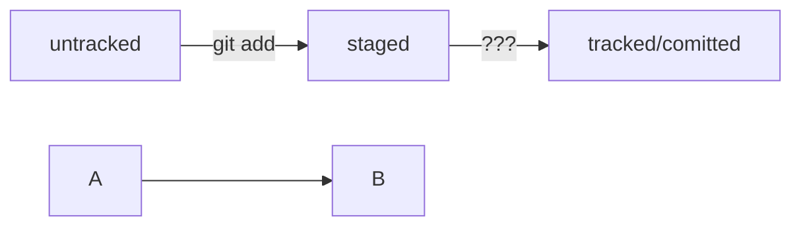

# Лабораторная работа №2
## Начало работы c Git

## Знакомство с GitHub

GitHub — платформа для хранения IT-проектов и совместной работы над ними с использованием
Git. По сути, это сайт, куда можно загрузить файлы своего проекта для обмена с другими людьми.
С английского языка слово hub переводится как «узловая станция». И действительно, GitHub стал
самым популярным сайтом для хранения Git-репозиториев. Многие крупные компании, такие как
Google, Apple, Valve, используют GitHub для своих проектов.
GitHub подходит, чтобы отточить навыки работы с Git. Здесь можно завести аккаунт и вместе со
своей командой работать над любыми задачами.

## Создаём удаленный репозиторий

1) Заходим на свой аккаунт.
2) Переходим во вкладку **Repositories**, а затем нажимаем на зелёную кнопку **New**.
3) Называем его _first-project_ и делаем приватным, затем нажимает кнопку **Create repository**.
Удалённый репозиторий создан.

## Что такое SSH. Генерация SHH-ключа

Один из наиболее распространённых сетевых протоколов — **SSH** (от англ. Secure Shell Protocol).
Он обеспечивает безопасный обмен данными в сети. С помощью этого протокола можно получать
данные с удалённого компьютера или отправлять их на него. Трафик шифруется, поэтому протокол
безопасен.
SSH использует пару ключей для обеспечения безопасности — публичный и приватный.

Для того чтобы сгенерировать SHH-ключ надо ввести следующую команду:
```
$ ssh-keygen -t ed25519 -C "электронная почта, к которой привязан ваш аккаунт на GitHub"
```


## Привязываем SSH-ключ к GitHub

После выполнения команды ssh-keygen из предыдущего урока в директории ~/.ssh будет
создано два файла — id_ed25519 и id_ed25519.pub (или id_rsa и id_rsa.pub — в зависимости от
того, какой алгоритм вы использовали):

o id_ed25519/id_rsa — приватный ключ (файл без .pub в конце). Ни в коем случае не
копируйте его и не делитесь им.
o id_ed25519.pub/id_rsa.pub — публичный ключ (на это указывает расширение .pub).

1) Надо скопировать содержимое файло в буфер обмена.
2) Перейти на GitHub и выьирать пунк **Setting**
3) В меню Слева нажимает на **SSH and GPG keys.**
4) Выбираем New SSH Key, вставляем навзание и сам ключ.
5) Нажимает кнопку **ADD SSH key**
6) Проверить правильность ключа с помощью следующей команды 
```
$ ssh -T git@github.com
```

## Связываем локальный и удалённый репозитории

У меня есть локальный репозиторий first-project, который хранится на компьютере и удалённый репозиторий на GitHub. В прошлом уроке я сгенерировал SSH ключ для безопасной работы и готов связать удалённый репозиторий с локальным.

## Привязать удалённый репозиторий к локальному - git remote add

Для того чтобы привязать удалённый репозиторий, надо зайти на его страницу GitHub и скопировать SSH ключ затем в терминале ввести команду:
```
$ git remote add origin git@github.com:saymoneylong/Highly_efficient_technologies_Labs_2023.git
```

Затем надо убедиться что репозитории связались. Для этого вводим следующую команду:
```
$ git remote -v
```

## Синхронизируем локальные и удалённый репозитории

## Отправить изменнеия на удалённый репозиторий - git push

Первоначально надо подготовить файл с помощью **git add**, затем закоммитить с комментарием командой **git commit -m**. Осталось загрузить содержимое локального репозитория на GitHub. За это отвечает команда **git push**.
```
$ git push -u origin main
```

Заходим в репозиторий **Highly_efficient_technologies_Labs_2023** на GitHub и видим что в нём появились файлы с изменениями.


## Работа с графическим интерфейсом GitHub.

GitHub предоставляет удобный интерфейс для работы с репозиторием. Например если нажать на кнопку **commit** в правой части страницы, можно посмореть все коммиты в репозитории.


## Файл README.md

## Как создать и оформить README.md

Преимущество README.md в том, что средства командной работы (такие, как GitHub) могут
отображать его содержимое в браузере в виде удобной разметки. Для этого нужно не просто залить
текст, но и настроить шрифт, заголовки и отступы с помощью markdown. Маркда́ун — это
специальный язык разметки. Он позволяет красиво отформатировать текстовый документ.


# Пример файла README.md
Если собрать всё вместе, файл README.md может выглядеть так.
# Шпаргалка markdown
## Выделение текста
Вы можете выделять текст в markdown с помощью символов `_` или `*`. Например:
Пример _курсива_ и **жирного** текста.
## Заголовки
Заголовки можно создавать с помощью символа `#`. Чем больше `#`, тем меньше заголовок.
Например:
# Заголовок первого уровня
## Заголовок второго уровня
### Заголовок третьего уровня
## Выделение кода
Чтобы выделить текст как код, поместите его в тройные кавычки ```.
```
mkdir my_project
cd my_project
git init
```
Это лишь некоторые функции markdown.

# Практическая работа №1. "Делимся проектом с миром"

Реализуем проект-помощник - самую удобную шпаргалку по работу с Git:

1) Создаём репозиторий.
2) Добавляем в репозиторий файл READ.md и записываем в него всё что уже знаем.
3) Загружаем получившийся репозиторий на GitHub и убеждаемся, что локальный и удалённый версии индентичны.

## Хеш - идентификатор коммита

**Хеширование** (от англ. hash, «рубить», «крошить», «мешанина») — это способ преобразовать
набор данных и получить их «отпечаток».
При работе с Git хеши будут встречаться вам регулярно. Их можно будет передавать в качестве
параметра разным Git-командам, чтобы указать, с каким коммитом нужно произвести то или иное
действие.

# Иследуем лог

Сокращённый лог полезен, если нужно быстро найти нужный коммит среди сотни других.

## Элементы описания коммита

После вызова git log появляется список коммитов.
Разберём элементы, из которых состоит описание:

- Строка из цифр и латинских букв после слова **commit** - это хеш коммита;
- **Author** - имя автора и его электронная почта;
- **Date** - дата и время создания коммита;
- в конце находится сообщение коммита.

# HEAD - всему голова

Файл HEAD (англ. «голова», «головной») — один из служебных файлов папки .git. Он указывает на коммит, который сделан последним (то есть на самый новый).
В этом можно убедиться с помощью терминала. Перейдите в папку .git командой cd. Посмотрите содержимое файла HEAD командой cat.


# Практическая работа №2. Дополняем шпаргалку

1) Добавим в шпаргалку основную информацию из уроков о хеше, логе HEAD, статусах файлов оформлении сообщений к коммитам.
2)ИНформацию из каждого урока заливаем новым коммитом. Так вам будет проще отслеживать, как меняется шпаргалка  и увеличиваться объём наших знаний.
3) Особое внимание уделим материалу о статусах и жизненном цикле файлов Git. Схему изменения статусов можно описать словами. Например

```
modified +git add = staged
```
Попробуем использовать формат описания схем Mermaid. Принцип такой: вы описываете схему в специальном текстовом формате, а GitHub превращает описание в полноценную схему с блоками и стрелками.

Заготовка для схемы статусов файлов.


# Практическая работа №3. Нужно откатить изменения

## Когда написао ненужное

```
git restore <file>
```

## Когдауже накоммитил

```
git reset --hard <time travel!>
```
## Игнорирование файлов в Git

Чтобы Git игнорировал файлы и не пытаося добавить их в репозиторий, нужно создать файл .gitignore и записать в него названия игнорируемых файлов. В этом уроке написано, как это сделать.

.gitignore -  это обычный текстовый файл, который добавляют в корень репозитория и коммитят. В нём указывают все файлы, которые надо игнорировать (по одному имени на строку).

## Правила для .gitignore

- Если строка начинается с #, то это комментарий и он не учитывется
- Простое название файла. Например все файлы .DS_Store:

```
.DS_Store
```
- Если *, то файл будет проигнорирован вне зависимости от того, что будет вместо *

```
#игнорировать все файлы, которые заканчиваются на .jpeg
*.jpeg
```

-Вопросительный знак соотвествует одному любому символу.

```
file?.txt - будут проигнорированы файлы, такие как fileA, file1
```

- Квадратные скобки как и вопросительный, только указывает определеные символы для игнора.

```
file[0-2].txt - игнорировать все файлы file0, file1, file2 но не игнорировать file3, file4
```

-слеш указывает на каталоги. Если шаблон в .gitignore начинается со слеша, то Git проигнорирует файлы или каталоги только в корневой директории.
-Функция парных звёздочек (**) похожа на функцию одинарной (*). Отличие в том, как они работают с вложенными папками. Двойная звёздочка может соответствовать любому количеству таких папок (в том числе нулю). Одинарная может соответствовать только одной.
-восклицательный зеак инвертирует любое правило .gitignore

```
игнорировать все файлы JPEG но только не мем с Doge
*jpeg.
!doge.jpeg
```

# Пример файла .gitignore
```
build/
*.log
!examples/**/*.log

Игнорировать все файлы в каталоге build, игнорировать все файлы .log, не игнорировать *.log файлы в examples.
```
# .gitignore и git status
Игнорируемые файлы не отображаются в выводе команды *git status*. Чтобы их увидеть надо ввести ключ *--ignored: git status --ignored*. В таком случае в выводе *git status* появится раздел *Ignored files*.


 

# Практическая работа №4. Исследуем историю коммитов

В процессе понадобятся команды `git log` и `git diff`. Эти команды не раз пригодятся в реальной работе — для анализа текущего состояния репозитория и поиска ошибок или чтобы просто разобраться, откуда в проекте появилось изменение.

## Шпаргалка. Начало работы с Git

## Инициализация репозитория

git init - инициализируй репозиторий.

## Синхронизация локального и удалённого репозиториев

`git remote add origin`
`git remote -v`
`git push -u origin main`

## Подготовка файла к коммиту

`git add`
`git add --all`


## Создание и публикация коммита

`git commit -m "комментарий"`
`git push`

## просмотр информации о коммитах

`git log`
`git log --oneline`


## Просмотр состояния файлов
`git status`


## Добавление изменений в последний коммит
`git commit --amend --no-edit`
`git commit --amend -m`

## Откат файлов и коммитов
`git restore --staged .txt`
`git restore .txt`
`git restore --hard .txt`

## Просмотр изменений

`git diff`
`git diff`
`git diff --staged`
